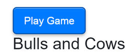

# Bulls and Cows Game

## Overview

Some people hesitate to use Blazor WASM because of the long wait time for the initial page load. But we can use a simple trick: quickly show some text while the client-side part loads in the background.

We used a mix of techniques: **Blazor WebAssembly** to create a smooth user interface, and server-side prerendering to help the page load quickly when you first open it. This combination helped us manage what happens on the page during the initial load and ensured everything worked well for users afterward. We also needed to find a way to prevent users from clicking things too early, before everything was ready. I will show you an easy way to do this with an additional client-side component.

To demonstrate our approach, we created a version of the **Bulls and Cows** game. This game is a good example of how we applied our methods. It helped us test our Blazor solutions and show how to fix common problems, resulting in a great web application experience.

[Here](https://bullsandcows2024.azurewebsites.net/) is working example.

## Architecture and Key Features

This project utilizes a hybrid rendering approach with **Blazor** to achieve optimal user experience and performance:

1.  **Server-Side Prerendering:**
    *   The application initially uses server-side rendering for the first page load. This technique allows for a quick display of the UI, significantly improving user experience during the initial interaction.
2.  **Client-Side WebAssembly Rendering:**
    *   Once prerendering is complete, the application fully transitions to **Blazor WebAssembly** for core gameplay. The client-side runtime takes over, handling all game logic directly in the user's browser. This approach minimizes server dependency and maximizes responsiveness.

### Key Features:

-   **Blazor Hybrid Rendering Mode:** Combines fast initial load times via server-side prerendering with interactive, real-time gameplay managed by client-side WebAssembly.
-   **Reusable Button Component:** A self-contained button component that begins disabled during prerendering, enabling only after the WebAssembly client is ready. This ensures that the user does not get to interact with the system before all the components and services get initialized.

-   **Client-Centered Gameplay:** The client-side WebAssembly runtime handles the core game logic, such as:
    *   Generating the secret number.
    *   Processing and validating player guesses.
    *   Providing instant bulls and cows feedback.
    
-   **Two Key Services**:
    *   **Game Service (`GameService`)**: Manages all aspects of gameplay directly in the browser, like generating the secret code, validating user guesses, and calculating feedback.
    *   **Statistics Service (`StatisticsService`)**: Runs on the client to manage persistent game data, including historical results, leaderboard rankings, time records, and high scores.

## Gameplay

The game challenges players to guess a secret number generated by the system, with feedback provided after each attempt in the form of "bulls" (digits in the correct position) and "cows" (correct digits in the wrong position). The game ends when the player correctly guesses the number or runs out of attempts.

### Game Flow

1.  **Start the Game:**  Click the "Play" button to start a new game. The system generates a random secret number.
2.  **Make Guesses:** Enter a guess and submit it.
3.  **Receive Feedback:** The game provides the number of "bulls" and "cows" for your guess.
4.  **Continue Guessing:** Use the feedback to refine your guesses.
5.  **Win or Lose:** Win by correctly guessing the number. Lose if you run out of attempts.
6.  **Review Statistics:** See your game statistics and high scores.

## Implementation Details

### Core Components
1.  **`GameService`**:
    *   Handles generating the secret number.
    *   Tracks guesses, bulls, and cows.
    *   Manages the game state (started, running, finished).
    *   Provides utilities such as starting/ending the game and managing the timer.

2.  **`StatisticsService`**:
    *   Stores and retrieves gameplay statistics, such as best scores (time, number of steps, wins) and historical data.
    *   Loads statistics on initialization and updates them during gameplay.

3.  **UI Components**:
    *   **Guess Input**: Allows players to submit guesses. Buttons that are not allowed for input are grayed out.

    *   **Guess List**: Displays a list of past guesses with their feedback. Pressing on the guessed number one after another will change the additional user note on the number, such as 'x', '?' here.

    *   **Game Status**: Displays the number of attempts remaining and the timer.

    *   **Game Over Screen**:  Highlights the win/loss result and detailed statistics.


> Note: Razor Components combine all parts into one, designed to make AI easy to access.

4. **Dynamic Timer**: Updates and stops based on the current game state.

### UI/UX

The user interface is implemented with a combination of **Blazor** and HTML/CSS, focusing on modern and user-friendly design:

*   Visually appealing layouts for attempts, timers, and gameplay elements.
*   Adaptive feedback mechanisms to provide clear contextual data (e.g., win/loss messages).
*   Flexible styling using CSS to ensure proper alignment and component modularity.

### Smoothly Switching to Client-Side Interactivity

Okay, let's discuss how we handle the transition from the server to the client-side, which is a common challenge in Blazor development. Our goal was to provide users with an immediate visual, rather than a blank screen, so we start by rendering a static version of the page. Then, after the client-side components and data are loaded, the game logic should become active. To manage this, we use a client-side button component that's initially disabled. This is a fairly straightforward approach.

We leverage the `OnAfterRenderAsync` lifecycle event, which we know is triggered after the client-side environment is fully initialized. Therefore, during the initial render, we present a disabled button. You can see in the first image, the button is inactive and cannot be clicked yet:


Once `OnAfterRenderAsync` is executed on the client, we enable the button and refresh it to display the enabled state. As you can see in the second image, the button is now active and ready for interaction:



Here are the relevant parts of the code:

```razor
@inject NavigationManager NavigationManager
...
<button class="start-button" @onclick="PlayGame" @onclick:preventDefault  disabled="@_isDisabled">@ButtonText</button>

@code {

    [Parameter]
    public string ButtonText { get; set; } = "Start Game"; 

    bool _isDisabled = true; // The button is initially disabled

    private void PlayGame()
    {
        NavigationManager.NavigateTo("/game-board"); // Navigates the user to the game board
    }


    protected override async Task OnAfterRenderAsync(bool firstRender)
    {
        await base.OnAfterRenderAsync(firstRender);
        if (firstRender) // Runs only on the component's first render on the client
        {
            _isDisabled = false; // Enables the button
            StateHasChanged(); // Notifies Blazor to update the button's state in the UI
        }
    }
}
```
> **Note**: You might have noticed @onclick:preventDefault on the button. Normally, when a button is clicked, the browser might try to navigate the page or perform other default actions. In our case, we don't want that; we only want the PlayGame method to be called by Blazor. Without @onclick:preventDefault, the browser might try to reload the page, and Blazor’s code might not execute as expected, especially during the initial transition from server to client. This is why we use it, to ensure that only Blazor handles the button click.

As you can see, the `_isDisabled` boolean field effectively controls the button's state, ensuring that it's only active once the client-side logic is fully operational. It's a concise and practical solution for managing this transition and improving user experience.


### Persistence and State Management

*   The game state is maintained using services like `GameService`.
*   The UI is dynamically updated using **Blazor data-binding** and event handlers.
*   Leaderboard and statistics are persisted across sessions using the `StatisticsService`.

### Navigation

The app includes navigation features using Blazor's **`NavigationManager`**:

*   Links to help and instruction pages.
*   Redirects to relevant game states.

## Features

*   **Interactive Gameplay:**  Real-time feedback on guesses with bulls and cows counts.
*   **Timed Play:** Optional timer to add an extra layer of challenge. Maximal duratio is 1 hour.
*   **Attempts Tracking:** Display of the number of remaining attempts.
*   **Statistics and Leaderboard:**  High score table that tracks performance.
*   **Help and Instructions:** A dedicated page with game rules and instructions.
*   **Dynamic UI Updates:** Seamless UI updates via Blazor for enhanced gameplay.

## Services Testability and Why We Need TimerWrapper

When developing services, testability is crucial to ensure that the business logic works as expected, independently of external factors.
However, testing services that depend on time-related functionality (like timers or duration tracking) can be challenging. Real-world timers inherently depend on external conditions, making the tests unreliable and slow.
Here the concept of the `TimerWrapper` becomes useful. Instead of real timers, we use the `ITimerWrapper` interface, whose implementation we can simulate through our tests and use real timers in the application.

## Future Enhancements

*   **Difficulty Levels:** Add options to change the complexity of the game.
*   **Multiplayer Mode:** Implement competitive play.
*   **AI Opponent:**  Add an AI to guess or generate numbers.
*   **Mobile Responsiveness:** Optimize UI for mobile devices.

## Conclusion

The **Bulls and Cows** game project provides an engaging and modern take on a classic puzzle, showcasing how Blazor can create responsive, efficient, and user-friendly web applications. Feel free to explore the code and contribute to future development!